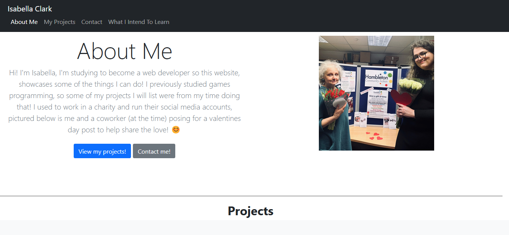
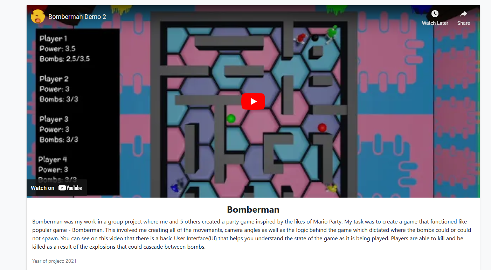
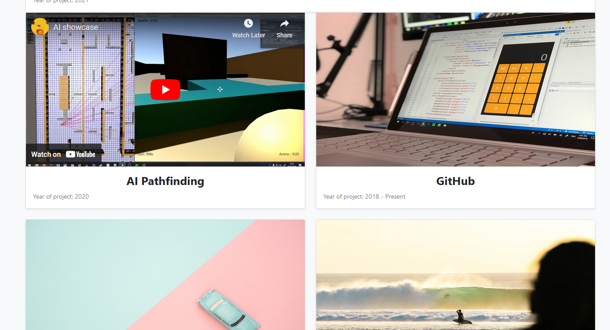
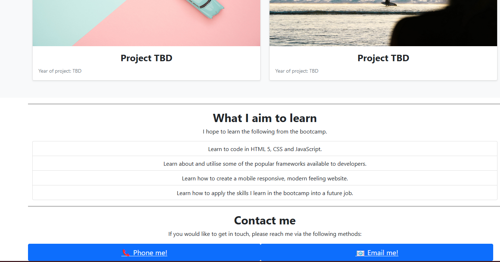

# Bootstrap Portfolio

# Description

Portfolio website utilising HTML, CSS and Bootstrap 5 elements.
 
# Installation

Open the link in a modern browser (Tested on Firefox and Chrome): (https://therandommer.github.io/Portfolio-Website/)

# Usage

When you open the site in your browser you should see a site that looks like the screenshots in the below:

## Desktop

## License

Using MIT License.

